# Pipeline v2 state machine

Auto-generated from litehive/pipeline/transitions.py via
litehive.pipeline.diagram.render_markdown. Regenerate with:

```bash
python -c "from litehive.pipeline.diagram import render_markdown; print(render_markdown())" > docs/state-machine-diagram.md
```

```mermaid
stateDiagram-v2
    [*] --> ready
    done --> [*]
    failed --> [*]
    ready --> worktree_sync : CleanState
    ready --> recovering_pre_exec : NeedsPreExecRecovery
    worktree_sync --> before_grooming : Pass
    worktree_sync --> before_implementing : Pass
    worktree_sync --> recovering : Reject
    worktree_sync --> recovering : Crash
    worktree_sync --> recovering : Timeout
    recovering_pre_exec --> <dynamic> : PreExecRecoverySucceeded
    recovering_pre_exec --> failed : PreExecRecoveryFailed
    recovering_pre_exec --> failed : PreExecRecoveryBudgetHit
    recovering_pre_exec --> failed : Crash
    recovering_pre_exec --> failed : Timeout
    before_grooming --> grooming : HookOk
    grooming --> after_grooming : Pass
    after_grooming --> before_implementing : HookOk
    before_implementing --> implementing : HookOk
    implementing --> after_implementing : Pass
    after_implementing --> done : HookOk
    after_implementing --> before_commit : HookOk
    after_implementing --> before_testing : HookOk
    before_testing --> testing : HookOk
    testing --> after_testing : Pass
    after_testing --> before_accepting : HookOk
    before_accepting --> accepting : HookOk
    accepting --> after_accepting : Pass
    after_accepting --> before_commit : HookOk
    before_commit --> commit : HookOk
    commit --> after_commit : Pass
    after_commit --> done : HookOk
    before_grooming --> recovering : Reject
    grooming --> recovering : Reject
    after_grooming --> recovering : Reject
    before_implementing --> implementing : Reject
    before_implementing --> recovering : Reject
    implementing --> implementing : Reject
    implementing --> recovering : Reject
    after_implementing --> implementing : Reject
    after_implementing --> recovering : Reject
    before_testing --> implementing : Reject
    before_testing --> recovering : Reject
    testing --> implementing : Reject
    testing --> recovering : Reject
    after_testing --> implementing : Reject
    after_testing --> recovering : Reject
    before_accepting --> implementing : Reject
    before_accepting --> recovering : Reject
    accepting --> implementing : Reject
    accepting --> recovering : Reject
    after_accepting --> implementing : Reject
    after_accepting --> recovering : Reject
    commit --> merge_resolving : MergeConflictDetected
    merge_resolving --> after_commit : Pass
    merge_resolving --> recovering : Reject
    merge_resolving --> recovering : Blocked
    merge_resolving --> recovering : Crash
    merge_resolving --> recovering : Timeout
    before_commit --> recovering : Reject
    commit --> recovering : Reject
    after_commit --> recovering : Reject
    grooming --> recovering : Blocked
    implementing --> recovering : Blocked
    testing --> recovering : Blocked
    accepting --> recovering : Blocked
    accepting --> recovering : StageRetryLimitHit
    after_accepting --> recovering : StageRetryLimitHit
    after_commit --> recovering : StageRetryLimitHit
    after_grooming --> recovering : StageRetryLimitHit
    after_implementing --> recovering : StageRetryLimitHit
    after_testing --> recovering : StageRetryLimitHit
    before_accepting --> recovering : StageRetryLimitHit
    before_commit --> recovering : StageRetryLimitHit
    before_grooming --> recovering : StageRetryLimitHit
    before_implementing --> recovering : StageRetryLimitHit
    before_testing --> recovering : StageRetryLimitHit
    commit --> recovering : StageRetryLimitHit
    grooming --> recovering : StageRetryLimitHit
    implementing --> recovering : StageRetryLimitHit
    testing --> recovering : StageRetryLimitHit
    accepting --> recovering : OverallRetryLimitHit
    after_accepting --> recovering : OverallRetryLimitHit
    after_commit --> recovering : OverallRetryLimitHit
    after_grooming --> recovering : OverallRetryLimitHit
    after_implementing --> recovering : OverallRetryLimitHit
    after_testing --> recovering : OverallRetryLimitHit
    before_accepting --> recovering : OverallRetryLimitHit
    before_commit --> recovering : OverallRetryLimitHit
    before_grooming --> recovering : OverallRetryLimitHit
    before_implementing --> recovering : OverallRetryLimitHit
    before_testing --> recovering : OverallRetryLimitHit
    commit --> recovering : OverallRetryLimitHit
    grooming --> recovering : OverallRetryLimitHit
    implementing --> recovering : OverallRetryLimitHit
    testing --> recovering : OverallRetryLimitHit
    recovering --> <dynamic> : RecoverySucceeded
    recovering --> failed : RecoveryFailed
    recovering --> failed : RecoveryBudgetHit
    recovering --> failed : Crash
    recovering --> failed : Timeout
    accepting --> recovering : Crash
    after_accepting --> recovering : Crash
    after_commit --> recovering : Crash
    after_grooming --> recovering : Crash
    after_implementing --> recovering : Crash
    after_testing --> recovering : Crash
    before_accepting --> recovering : Crash
    before_commit --> recovering : Crash
    before_grooming --> recovering : Crash
    before_implementing --> recovering : Crash
    before_testing --> recovering : Crash
    commit --> recovering : Crash
    grooming --> recovering : Crash
    implementing --> recovering : Crash
    testing --> recovering : Crash
    accepting --> recovering : Timeout
    after_accepting --> recovering : Timeout
    after_commit --> recovering : Timeout
    after_grooming --> recovering : Timeout
    after_implementing --> recovering : Timeout
    after_testing --> recovering : Timeout
    before_accepting --> recovering : Timeout
    before_commit --> recovering : Timeout
    before_grooming --> recovering : Timeout
    before_implementing --> recovering : Timeout
    before_testing --> recovering : Timeout
    commit --> recovering : Timeout
    grooming --> recovering : Timeout
    implementing --> recovering : Timeout
    testing --> recovering : Timeout
```


